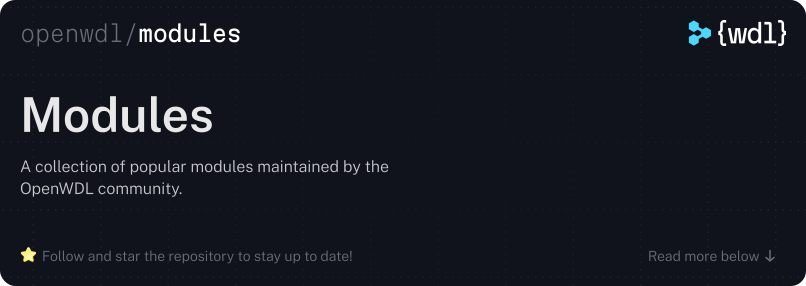

  

 

This repository is a community-maintained collection of [WDL](https://github.com/openwdl/wdl)
modules for some of the most widely used tools in bioinformatics. It is not
intended to be exhaustive—the goal is to cover the tools the community reaches
for most often and to demonstrate best practices for writing WDL tasks and
workflows. Each module can be imported directly into your own workflows as a
stable, versioned starting point.

# Licensing

This repository is dual-licensed under [MIT](./LICENSE-MIT) or
[Apache-2.0](./LICENSE-APACHE) at your option.

Every module in this repository contains only workflow logic—that is, WDL code
that describes *how* to run tools, not the tools themselves. The tools that
modules reference are independent software projects with their own licenses,
which may include copyleft licenses such as the GPL. Maintaining that separation
helps support this repository’s permissive licensing model: we describe how to
invoke a tool, but we do not include the tool itself.

## Boundaries we maintain

Because including downstream tools in this repository could affect its
permissive licensing, we maintain strict separation between our workflow code
and the software it orchestrates:

* **Downstream tools do not live in this repository.** We do not check in
third-party source code, binaries, libraries, scripts copied from upstream or
downstream projects, or container images—regardless of their license. Each
external tool is an independent project maintained and distributed by its own
authors under its own terms.
* **No prebuilt artifacts are published from this repository.** We do not
produce container images, binary bundles, or any other artifact that
incorporates third-party software.
* **No mirroring or caching of external software.** This repository does not
operate as a registry, mirror, cache, or distribution channel for anything
other than the WDL modules themselves.
* **No linking or embedding.** Modules must invoke external tools as separate
executables through simple command-line calls. They must not dynamically link
to, share memory with, or otherwise incorporate third-party code at the
language level.
* **Care with helper materials.** Contributors must not introduce third-party
code or other non-workflow material through helper scripts, example assets,
test fixtures, CI artifacts, or similar side materials. Any such material
must be reviewed carefully to ensure it does not copy, embed, or redistribute
third-party software.

Pull requests that introduce third-party source code, binaries, container
images, or other non-workflow artifacts into the repository will be closed
without merging with this section of the `README.md` referenced.

Modules do reference external container images—typically those officially
distributed by the tool's authors or hosted on [BioContainers](https://biocontainers.pro)—but those images
are fetched independently by the workflow engine at runtime and remain governed
by their own license terms. Contributors and downstream users are responsible
for reviewing and complying with any license obligations associated with the
software they choose to pull and execute.

## Tool licenses

Each tool referenced by a module carries its own license, independent of this
repository's dual license. The primary concern when evaluating tool licenses is
whether a license imposes obligations that extend beyond simple distribution—in
particular, licenses that trigger copyleft requirements through network
interaction, SaaS deployment, or similar use-based mechanisms pose risks that
architectural separation alone cannot mitigate.

The lists below identify licenses that are
pre-approved for use and those that are prohibited outright. If the tool you
wish to reference carries a license not found in either list, include a license
review in your pull request (follow the template); it will be evaluated before
the module is accepted.

### Approved Licenses

The following licenses have been approved (listed in alphabetical order):

- [Apache License 2.0](https://www.apache.org/licenses/LICENSE-2.0) · [`Apache-2.0`](https://spdx.org/licenses/Apache-2.0.html)
- [BSD 3-Clause "New" or "Revised" License](https://opensource.org/license/bsd-3-clause) · [`BSD-3-Clause`](https://spdx.org/licenses/BSD-3-Clause.html)
- [GNU General Public License v2.0 only](https://www.gnu.org/licenses/old-licenses/gpl-2.0.html) · [`GPL-2.0-only`](https://spdx.org/licenses/GPL-2.0-only.html)
- [GNU General Public License v3.0 only](https://www.gnu.org/licenses/gpl-3.0.html) · [`GPL-3.0-only`](https://spdx.org/licenses/GPL-3.0-only.html)
- [GNU Lesser General Public License v2.1 only](https://www.gnu.org/licenses/lgpl-2.1.html) · [`LGPL-2.1-only`](https://spdx.org/licenses/LGPL-2.1-only.html)
- [MIT License](https://opensource.org/license/mit) · [`MIT`](https://spdx.org/licenses/MIT.html)

### Prohibited Licenses

The following licenses are incompatible with this repository regardless of how a
tool is invoked:

- [GNU Affero General Public License v3.0 only](https://www.gnu.org/licenses/agpl-3.0.html) · [`AGPL-3.0-only`](https://spdx.org/licenses/AGPL-3.0-only.html)
  - The AGPL triggers copyleft obligations when software is accessed over a
    network—not just when it is distributed. Because workflow engines may execute
    tools across networked infrastructure, the AGPL's scope extends beyond what
    architectural separation alone can address.

### Expectations for contributors

When you submit a contribution, you are representing that:

1. You have the right to license your contribution under the terms of this
   repository.
2. Your contribution contains only original workflow logic and does not include
   third-party source code, binaries, container images, or copied third-party
   scripts or similar materials.
3. You have identified every external tool your module invokes and included the
   license for each tool in the pull request description according to the pull
   request template. Modules that reference tools with an unknown license will
   not be accepted.
4. When updating a module to reference a new version of an external tool, you
   have re-verified that the tool's license has not changed in a way that is
   incompatible with this repository's policies. The license must be confirmed
   and stated in the pull request description for every version bump, not just
   the initial contribution.
5. None of the tools your module references are released under the licenses in
   the [prohibited list above](#prohibited-licenses) or any other license that
   triggers obligations upon the concerns outlined in [the tool
   license](#tool-licenses) section.

We have included a pull request template that outlines these requirements.

# Contributing

See [CONTRIBUTING.md](./CONTRIBUTING.md).